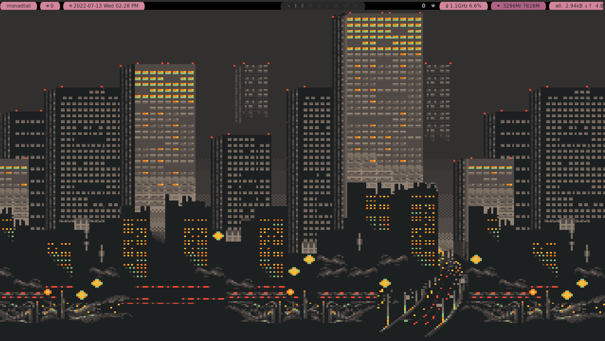

# Arch-qtile


This repository contains configuration files I use on my host system, which is Arch Linux. I sync those in order to simplify setting up working environment whenever I have to.

I mostly try to keep configuration files as minimalistic as possible in order to make things easier and not to pollute the environment.

# KeyBinds

| Key               | Action                 |
| ----------------- | ---------------------- |
| super + Return    | kitty                  |
| super + r         | rofi                   |
| super + b         | brave                  |
| super + o         | firefox                |
| Print + PrtSc     | flameshot              |
| super + [1-9]     | focus on desktop 1-9   |
| super + shift + l | lock screen (i3 lock)  |
| super + shift + e | exit wm                |
| super + shift + r | restart wm             |
| super + Tab       | toggle floating/tiling |
| super + w         | kill focused window    |
| alt + Tab         | toggle window focus    |
| super + f         | toggle fullscreen      |

# Stuffs In Rice

- WM: Qtile
- AppLauncher: rofi
- Font: [Iosevka](https://archlinux.org/packages/community/any/ttf-iosevka-nerd/
- LockScreen: i3lock-color
- PdfReader: zathura
- Shell: bash, zsh
- Terminal: kitty and Alacritty
## Must have packages for volume and brightness control
`sudo pacman -S alsa-utils lxappearance brightnessctl`
## Bluetooth connection
1. `sudo pacman -S bluez bluez-utils blueman`
 2. `sudo systemctl start bluetooth`
  3. `sudo systemctl enable bluetooth
`
# To install and configer lightdm
1. install light with the following command ``` paru pacaur -S lightdm-webkit-theme-aether```
2. Go to ```cd /etc/lightdm``` change default sessions to qtile then save exit
3. Enable it with the following ```sudo systemctl start lightdm.service && sudo systemctl enable lightdm.service -f```.
4. Reboot.


## Others
Install pip using pacman
``
sudo pacman -S python-pip
``
After this you need to install qtile dependencies
1. `pip install dbus-next`

- Fetch: [fetch](https://github.com/Manas140/fetch)
- FileManager: nautilus
- ImageViewer: feh
- MusicVisualiser: cava
- ScreenShot: flameshot, maim
- TextEditor: nvim, vscode
- Video player: MPV
- Icons: [Gruvbox](https://www.pling.com/p/1681313/)
- PdfReader: Sioyek(Sioyek is a PDF viewer designed for reading research papers and technical books.)[](https://sioyek-documentation.readthedocs.io/en/latest/index.html)
